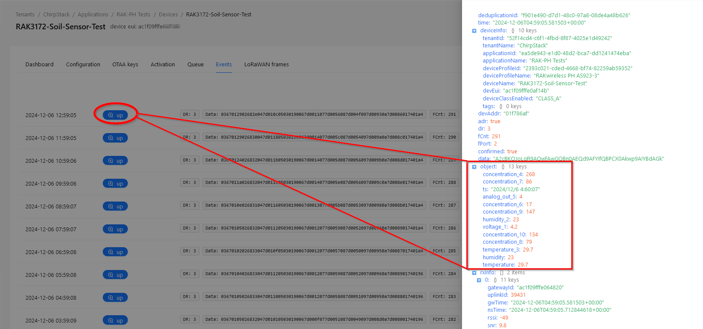

# RUI3-RS485-Soil-Sensor
|  |  |    
| :-: | :-: |    

Example for a RS485 soil sensor using RAKwireless RUI3 on a RAK3172.

Tested with the "No-Name" VEM SEE SN-3002-TR-ECTHNPKKPH-N01 sensor.    
Code is prepared for the GEMHO 7in1 Soil Sensor with RS485, but not tested.

# Components

----

## Soil sensor

### VEM SEE SN-3002-TR-ECTHNPKKPH-N01, translated datasheet is in [assets](./assets/SoilSensor-7-values-datasheet_en.docx)

#### ⚠️ IMPORTANT ⚠️ Requires to set #define VEMSEE

Sensor works by default with 4800 Baud

VEM SEE SN-3002-TR-ECTHNPKKPH-N01 Soil Sensor register setup
| Address | Multiplier | Register content                              |
| ------- | ---------- | --------------------------------------------- |
| 0x0000  | /10        | Moisture                                      | 
| 0x0001  | /10        | Temperature                                   | 
| 0x0002  | *1         | Conductivity                                  | 
| 0x0003  | /10        | pH                                            | 
| 0x0004  | *1         | Nitrogen content (temporary)                  | 
| 0x0005  | *1         | Phosphorus content (temporary)                | 
| 0x0006  | *1         | Potassium content (temporary)                 | 
| 0x0007  | *1         | Salinity                                      | 
| 0x0008  | *1         | TDS (for reference ?????)                     | 
| 0x0022  | *1         | Temperature coefficient of conductivity       | 
| 0x0023  | *1         | TDS coefficient                               | 
| 0x0050  | *1         | Temperature calibration value                 | 
| 0x0051  | *1         | Mositure content calibration value            | 
| 0x0052  | *1         | Conductivity calibration value                | 
| 0x0053  | *1         | pH calibration value                          | 
| 0x04e8  | *1         | Nitrogen content coefficient MSB (temporary)  | 
| 0x04e9  | *1         | Nitrogen content coefficient LSB (temporary)  | 
| 0x04ea  | *1         | Nitrogen deviation (temporary)                | 
| 0x04f2  | *1         | Phosphorus coefficient MSB (temporary)        | 
| 0x04f3  | *1         | Phosphorus coefficient LSB (temporary)        | 
| 0x04f4  | *1         | Phosphorus deviation (temporary)              | 
| 0x04fc  | *1         | Potassium content coefficient MSB (temporary) | 
| 0x04fd  | *1         | Potassium content coefficient LSB (temporary) | 
| 0x04fe  | *1         | Potassium deviation (temporary)               | 
| 0x07d0  | *1         | Device address                                | 
| 0x07d1  | *1         | Baud Rate                                     | 

----

### GEMHO 7in1 Soil Sensor with RS485, datasheet is in [assets](./assets/Gemho_RS485_Type_Soil_7in1_Sensor.pdf)

#### ⚠️ IMPORTANT ⚠️ Requires to set #define GEMHO

Sensor works by default with 9600 Baud

GEMHO 7in1 Soil Sensor with RS485 register setup
| Address | Multiplier | Register content                              |
| ------- | ---------- | --------------------------------------------- |
| 0x0006  | /100       | Temperature                                   | 
| 0x0007  | /100       | Moisture                                      | 
| 0x0008  | *1         | Conductivity                                  | 
| 0x0009  | /100       | pH                                            | 
| 0x000F  | *1         | Device address                                | 
| 0x001E  | *1         | Nitrogen content (temporary)                  | 
| 0x001F  | *1         | Phosphorus content (temporary)                | 
| 0x0020  | *1         | Potassium content (temporary)                 | 

----

## WisBlock modules & enclosure
- [RAK3172 Evaluation Board](https://docs.rakwireless.com/product-categories/wisduo/rak3172-evaluation-board/overview/) with
   - [RAK19007](https://docs.rakwireless.com/product-categories/wisblock/rak19007/overview) WisBlock Base Board
   - [RAK3372](https://docs.rakwireless.com/product-categories/wisblock/rak3372/overview) WisBlock Core module with STM32WLE5
   - [alternative RAK4631](https://docs.rakwireless.com/product-categories/wisblock/rak4631/overview) WisBlock Core module with nRF52840
- [RAK5802-M](https://docs.rakwireless.com/product-categories/wisblock/rak5802/overview) WisBlock RS485 module (modified variant)
- [RAK19002](https://docs.rakwireless.com/product-categories/wisblock/rak19002/overview) WisBlock 12V booster for supply of soil sensor
- [Unify Enclosure 150x100x45 with Solar Panel](https://docs.rakwireless.com/product-categories/wisblock/rakbox-uo150x100x45-solar/overview/)
- 3200mAh battery

----

# Assembly

Assembly is done with the "standard" mounting plate of the Unify Enclosure.       
Sensor connection is done with the 5-pin IP65 connector of the Unify Enclosure with Solar Panel    
Antenna used is [Blade Antenna](https://docs.rakwireless.com/Product-Categories/Accessories/RAKARJ16/Overview/) with 2.3 dBi gain.

<center>&nbsp&nbsp&nbsp&nbsp</center>

#### ⚠️ IMPORTANT ⚠️    
RAK19002 12V booster _**must**_ be installed in the Sensor Slot B    

----

# Modbus Wiring diagram

<center></center>

----

# Firmware

Firmware is based on [RUI3-RAK5802-Modbus-Master](https://github.com/RAKWireless/RUI3-Best-Practice/tree/main/ModBus/RUI3-RAK5802-Modbus-Master) with adjustements for the used RS485 sensor.

To achieve good sensor readings, the sensor is powered up for 5 minutes before the sensor data is read. This gives the sensor time to do the readings and calculations.

----

## Custom AT commands

### Send Interval
Send interval of the sensor values can be set with a custom AT command. Interval time is set in _**seconds**_

_**`ATC+SENDINT?`**_ Command definition
> ATC+SENDINT,: Set/Get the interval sending time values in seconds 0 = off, max 2,147,483 seconds    
OK

_**`ATC+SENDINT=?`**_ Get current send interval in seconds
> ATC+SENDINT=3600    
OK

_**`ATC+SENDINT=3600`**_ Get current send interval to 3600 seconds == 1 hour
> ATC+SENDINT=3600    
OK

#### ⚠️ IMPORTANT ⚠️  
Send interval cannot be less than 2 times the sensor power on time. With the current settings the minimum send interval is 10 minutes

----

### Sensor Test
Sensor connection can be tested with a custom AT command.

_**`ATC+STEST?`**_ Command definition
> ATC+STEST,R*W: Read sensor    
OK

_**`ATC+STEST=?`**_ Start sensor test
> ATC+STEST=?    
OK

#### ⚠️ IMPORTANT ⚠️  
After starting the test, it takes 15-20 seconds before a result is available. The output of the command is:

_**Sensor found**_
```log
> atc+stest=?
Sensor Power Up
OK
+EVT:Sensor Values: M:22.10-T:25.70-pH:3.00-C:140.0
```
The values are soil humidity (M), temperature (T) pH value (pH) and conductivity (C). If the sensor is not in soil, these values might be zeros or not making any sense.


_**Sensor not found**_
```log
> atc+stest=?
Sensor Power Up
OK
+EVT:Error reading sensor
```

_**Sensor reading already active**_ This can be because a manual started test is not finished yet or the scheduled automatic sensor reading is active
```log
> atc+stest=?
AT_BUSY_ERROR
```

----

## Write to coils or registers (Not used in this example code)

To control the coils, a downlink from the LoRaWAN server is required. The downlink packet format is     
`AA55ccddnnv1v2` as hex values       
`AA55` is a simple packet marker       
`cc` is the command, supported is only MB_FC_WRITE_MULTIPLE_COILS    
`dd` is the slave address    
`nn` is the number of coils to write     
`v1`, `v2` are the coil status. 0 ==> coil off, 1 ==> coil on, `nn` status are expected     

To write to registers, a downlink from the LoRaWAN server is required. The downlink packet format is     
`AA55ccddnnv1v2` as hex values       
`AA55` is a simple packet marker       
`cc` is the command, supported are MB_FC_WRITE_REGISTER and MB_FC_WRITE_MULTIPLE_REGISTERS    
`dd` is the slave address    
`aa` is the start address of the registers
`nn` is the number of registers to write     
if MB_FC_WRITE_REGISTER    
	`v1` and `v2` is the 16bit value to write to the register    
if MB_FC_WRITE_MULTIPLE_REGISTERS    
	`v1` and `v2` are the 16bit value to write to the register, `nn` arrays of `v1` and `v2` are expected    
   
----

# Visualization of the Sensor Data

To visualize the sensor data, the following (free) extensions are used:

- [InfluxDB](https://www.influxdata.com/). Two options, (1) Use the InfluxDB Cloud Serverless or (2) installing InfluxDB on your own server.  I used (2) and run InfluxDB on my VPS.
- [Grafana](https://grafana.com/). Two options, (1) using the Grafana Cloud or (2) installing Grafana on your own server. I used (2) and run Grafana on my VPS.
- InfluxDB integration on the LoRaWAN server (I use Chirpstack V4). My Chirpstack installation is as well on my VPS.

----

## Setup 

#### ⚠️ INFO ⚠️
The complete system is setup on a VPS with [Docker](https://www.docker.com/) containers. All required Docker containers are installed with a custom Docker YAML file and for maintaining of the containers I use [Portainer](https://www.portainer.io/), a Docker management tool.    
This includes the [Chirpstack V4](https://www.chirpstack.io/) LoRaWAN server, InfluxDB and Grafana.

----

### Register the sensor nodes in the LoRaWAN server

_**No detailed instructions for this part, these steps are common steps to connect sensor nodes to a LoRaWAN server**_

(1) Setup the LoRaWAN server and connect the gateway(s) to it. Make sure both LoRaWAN server and the gateway(s) are setup to the same LoRaWAN region.    
(2) Setup an application on the LoRaWAN server    
(3) Setup the sensor nodes in the application with their DevEUI, AppEUI and AppKey (if OTAA is used) or with their DevAddress, AppSKey and NwSKey (if ABP is used)    
(4) Check if the sensor data are received by the application in the LoRaWAN server    

<center></center>

----

### Setup the Codec in Chirpstack

To receive the data in the influxDB database, a payload decoder is required in Chirpstack. Payload decoders are setup in the _**Device Profiles**_ in Chirpstack. In the Chirpstack web UI switch to the _**Device Profiles**_ and select _**Codecs**_.    

<center></center>

Open the _**Codec**_ tab. By default the Payload codec is set to _**None**_. Change it to _**JavaScript functions**_

<center></center>

RAKwireless has a ready to use JavaScript decoder for Chirpstack. You can get it from the [RAKwireless_Standardized_Payload](https://github.com/RAKWireless/RAKwireless_Standardized_Payload/blob/main/RAKwireless_Standardized_Payload.js) Github repository.     

<center></center>

Use the _**Raw**_ button to see the Javascript as plain text. Copy the complete Javascript code and paste it into the Chirpstack _**Codec functions**_ text field.    

<center></center>

To check that the decoder is working, go back to the device in Chirpstack and select _**Events**_. This will show the received data.    
Click on the _**up**_ button of a received packet and the decoded payload will be shown:    

<center></center>

----

### Installation of InfluxDB and Grafana

The installation of InfluxDB and Grafana is done through the Docker YAML file.    
Important are the local IP addresses of the two applications, which can be obtained through the Portainer management tool.    

<center></center>

----

### Setup the InfluxDB database

In InfluxDB web UI, create an access token to allow access.

(1) Open the _**Load Data**_ menu and select _**API Tokens**_

<center></center>

(2) Create two tokens using the _**GENERATE API TOKEN**_ button, one for Chirpstack and one for Grafana. 

<center></center>

These tokens will be required in the next steps!

#### ⚠️ IMPORTANT ⚠️
_**Make sure to copy the tokens into a safe place. They can be only read during the creation of the tokens.**_

Create an organization and a bucket for the sensor data.     

(3) Create organization and a bucket

<center></center>

Here we use _**RAKwireless**_ for both the organization and the bucket.    

<center></center>

----

### Setup the InfluxDB integration in Chirpstack

In the Chirpstack web UI, open the application and select the _**Integrations**_ tab:

<center></center>

Then fill out the connection details to the InfluxDB database.     
- In this installation influxDB version 2 is used.      
- The API endpoint is the IP address of the influxDB docker instance we got from Portainer.    
- Organization and Bucket are the ones we created in influxDB
- Token is the access token we created in influxDB

<center></center>

----

### Setup Grafana

In the Grafana web UI, open _**Connections**_, then _**Add new connection**_ to setup the connection to the influxDB database.    

<center></center>

Select InfluxDB as new connection.    

<center></center>

Setup the connection using the IP address and token obtained earlier    

<center></center>

- User name is the influxDB organisation user
- Password is the influxDB organisation password
- Organization name is the organisation setup in influxDB
- Token is the toke created in influxDB for the Grafana access
- Default bucket is the bucket created in influxDB

<center></center>

Use the _**Save & test**_ button to check if Grafana can access the database.    

----

### Check the data is arriving in the database

Open the influxDB web UI and open the _**Data Explorer**_.         
Select the correct bucket.
The easiest way to find the data is to use soil sensors **DevEUI** as the first filter.     
Then use **_measurement** as the second filter. You will see now all the data that was received from the soil sensor.

<center></center>

As you can see, there are many entries. Each entries name has the sensor number at the end we assigned in the application code.      
```cpp
// Cayenne LPP Channel numbers per sensor value
#define LPP_CHANNEL_BATT 1 // Base Board
#define LPP_CHANNEL_MOIST 2
#define LPP_CHANNEL_TEMP 3
#define LPP_CHANNEL_COND 4
#define LPP_CHANNEL_PH 5
#define LPP_CHANNEL_NITRO 6
#define LPP_CHANNEL_PHOS 7
#define LPP_CHANNEL_POTA 8
#define LPP_CHANNEL_SALIN 9
#define LPP_CHANNEL_TDS 10
```

For example:     
> _**`device_frmpayload_data_temperature_3`**_     

refers to the soil temperature
```cpp
// Add temperature level to payload
g_solution_data.addTemperature(LPP_CHANNEL_TEMP, coils_n_regs.sensor_data.reg_2 / 10.0);
```

Once _**`device_frmpayload_data_temperature_3`**_ is selected, add one more filter with _**`value`**_ to get the temperature values from the database query. Then push the _**SUBMIT**_ button. The graph will show the recorded temperature measurements.     

<center></center>

#### ⚠️ TIP ⚠️
influxDB Data Explorer gives the option to see the query as Flux query. This can be directly used in Grafana to collect the data from the influxDB database.     

Push the _**SCRIPT EDITOR**_ button to see the Flux query.      

<center></center>

Copy and save the Flux Query, it will be used in the Grafana dashboard later.     

----

### Setup Grafana Dashboard

Open the Grafana web UI and go to _**Home**_ => _**Dashboards**_. Then click on the _**New**_ button and select _**New dashboard**_.    

<center></center>

On the next window select the option to _**Add visualization**_

<center></center>

Then select influxdb as the data source.     

<center></center>

A new window with the visualization details will be shown.    
Take the Flux query copied from influxDB DataExplorer earlier and copy it into the query field.

<center></center>

There are many options to change how the data will be presented. Here only the _**Panel Title**_ is changed to **Soil Temperature**. The Grafana documentation explains the other options.    

<center></center>

Push the _**Apply**_ button to add the visualization to the new Dashboard.

<center></center>

Now the panel with the soil temperature is shown in the dashboard.    

<center></center>

To add the other sensor values, there are two ways:    
- use the _**Add**_ => _**Visualization**_ option from the top menu and repeat the above steps for the new sensor value
<center></center>

- duplicate the existing visualization and just change the title and Flux query
<center></center>

If _**Duplicate**_ is chosen, open the visualization menu and select _**Edit**_.     

<center></center>

In the edit window only two things need to be changed, the source in the Flux query and the title. Here the source is changed to the moisture level (**`device_frmpayload_data_humidity_2`**) and title to _**Soil Moisture**_     

<center></center>

Other sensor values can be added to the Dashboard the same way. When all sensor values are visualized, the Dashboard will look like this:

<center></center>

----
----

# LoRa® is a registered trademark or service mark of Semtech Corporation or its affiliates. 


# LoRaWAN® is a licensed mark.

----
----
